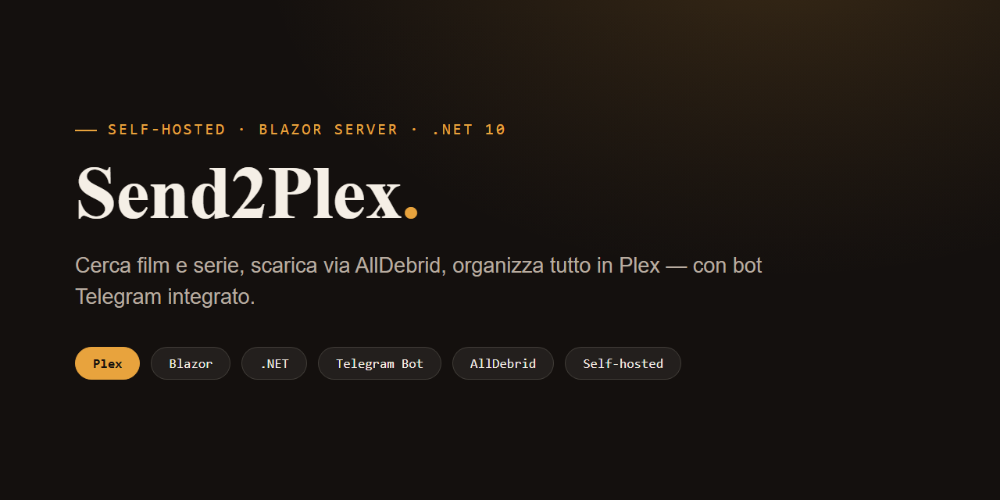

# Send2Plex



[](https://dotnet.microsoft.com/)
[](https://dotnet.microsoft.com/apps/aspnet/web-apps/blazor)
[](docs/idee-porting-multipiattaforma.md)
[](LICENSE)

App web personale (Blazor Server, .NET 10) che cerca film e serie TV su più fonti, scarica
tramite AllDebrid e organizza tutto in una libreria Plex — con un bot Telegram integrato nello
stesso processo per il controllo da remoto.

> Progetto per uso personale: automatizza una libreria Plex già posseduta, non ospita né
> distribuisce contenuti. Chi lo usa è responsabile di rispettare le leggi sul copyright della
> propria giurisdizione.

## Cos'è

Send2Plex è l'evoluzione di un vecchio bot Telegram in WinForms: la logica di ricerca,
sblocco e download è la stessa, ma ora gira come applicazione web cross-platform (Blazor
Server, Windows o Linux/Docker) raggiungibile anche da telefono sulla rete locale, con il bot
Telegram ancora attivo in parallelo nello stesso processo.

**Funzionalità principali:**

- 🔎 **Ricerca multi-fonte**: interroga contemporaneamente più siti/indici configurabili e
  [Torrentio](https://torrentio.strem.fun/) (via TMDB → IMDb id), con filtri per stagione,
  risoluzione, lingua ed episodio.
- 🔓 **AllDebrid**: carica il magnet, aspetta che sia pronto, sblocca e scarica i file
  direttamente. Include anche una tab per gestire i magnet già presenti sull'account e per
  sbloccare un link diretto da un altro host (Rapidgator, Mega, ecc.).
- 🎬 **Libreria Plex**: mostra la libreria posseduta, evidenzia gli episodi mancanti di una
  serie, avvia il refresh Plex dopo ogni download. Supporta più librerie Movies/TV (es.
  Film + MCU + Star Wars) con cartella di destinazione dedicata per ciascuna.
- 📥 **Coda download**: accoda più risultati mentre cerchi e falli partire tutti insieme,
  invece di aspettare che ognuno finisca prima di iniziare il successivo.
- 📊 **Cronologia**: elenco di tutto quello che è stato scaricato (o tentato), con statistiche
  cumulative.
- 🎞️ **Trailer e sigle**: trailer YouTube da TMDB e sigla della serie se Plex l'ha già cachata.
- 🌐 **VPN automatica per sito**: ogni sito di ricerca può essere marcato "richiede VPN" — la
  connessione a NordVPN parte/si ferma da sola solo quando serve.
- ⚙️ **Configurazione a caldo**: quasi tutte le impostazioni (percorsi, chiavi API, librerie
  Plex, siti di ricerca, VPN) si applicano subito dal salvataggio, senza riavviare l'app. Unica
  eccezione: il Bot Token Telegram, perché il client è già avviato — per quello basta comunque
  "mettere in pausa"/"riprendere" il bot dalla UI, senza riavviare l'intera app.
- 🤖 **Bot Telegram**: stessa logica di ricerca/download disponibile anche via Telegram,
  controllabile (pausa/ripresa) sia da lì (`/stop`, `/start`) sia dalla web UI.
- 📱 **Responsive**: utilizzabile da telefono sulla rete locale.

## Come funziona (in breve)

```
Cerca (sito o Torrentio) → risolvi magnet → carica su AllDebrid → attendi "ready"
    → sblocca i link dei file → scarica su disco → refresh libreria Plex → cronologia
```

La stessa pipeline è condivisa (`DownloadOrchestrator`) tra la pagina Cerca, la tab AllDebrid e
la coda download, così i tre punti di ingresso restano sempre coerenti tra loro.

## Requisiti

- Windows, Linux o Docker (multi-arch amd64/arm64) — vedi
  [docs/idee-porting-multipiattaforma.md](docs/idee-porting-multipiattaforma.md) per il porting
  cross-platform
- [.NET SDK 10](https://dotnet.microsoft.com/download) o superiore (non richiesto per l'immagine Docker)
- `ffmpeg`/`ffprobe` raggiungibili dal `PATH` (streaming/trascodifica) — già inclusi nell'immagine Docker
- Un server Plex raggiungibile in rete, con il relativo token
- Un account [AllDebrid](https://alldebrid.com/) con API key
- Un bot Telegram (creato con [@BotFather](https://t.me/BotFather)) e il tuo Chat ID
- (Opzionale) Una chiave [TMDB](https://www.themoviedb.org/settings/api) per poster, trailer,
  film/serie di tendenza e risoluzione titolo → IMDb id per Torrentio
- (Opzionale) [NordVPN](https://nordvpn.com/) con CLI, se qualche sito che usi richiede la VPN
  per essere raggiunto

## Setup

1. Clona il repository e apri una shell nella cartella del progetto.
2. Crea `appsettings.json` nella radice del progetto (il file reale non è incluso nel repo,
   vedi sotto perché) seguendo lo schema descritto in [Configurazione](#configurazione).
3. Avvia con:

   ```bash
   dotnet run --project Send2Plex.csproj
   ```

   oppure, su Windows, doppio click su `avvia-server.bat`.
4. L'app parte su `http://localhost:5075` (raggiungibile anche da altri dispositivi sulla
   stessa rete, es. `http://<ip-del-pc>:5075` — il binding a `0.0.0.0` è già impostato in
   `Program.cs`).
5. Da Impostazioni puoi verificare lo stato di tutti i servizi collegati ("Verifica stato") e
   caricare le librerie Plex disponibili per selezionare quali usare come Movies/TV.

## Configurazione

`appsettings.json` **non è incluso nel repo** perché contiene credenziali reali (Bot Token,
API key AllDebrid/TMDB, token Plex) e percorsi personali — vedi `.gitignore`. Le chiavi vengono
cifrate automaticamente (ASP.NET Core Data Protection) la prima volta che salvi da Impostazioni,
usando il key ring persistito in `dp-keys/` — copia anche quella cartella insieme ad
`appsettings.json` se sposti l'installazione altrove, altrimenti le credenziali cifrate non sono
più leggibili e vanno reinserite.

Struttura principale del file (valori di esempio):

```jsonc
{
  "General": { "StartMinimized": false, "AutoStartBot": true },
  "Telegram": {
    "BotToken": "",              // da @BotFather
    "AllowedChatIds": [],        // il tuo Chat ID Telegram (numerico)
    "MaxConcurrentJobs": 2
  },
  "AllDebrid": { "ApiKey": "", "Agent": "Send2Plex" },
  "Plex": {
    "BaseUrl": "http://localhost:32400",
    "Token": "",
    "MovieSectionIds": [1],      // ID delle sezioni Plex da trattare come "Movies"
    "TvSectionIds": [2]          // ID delle sezioni Plex da trattare come "TV"
  },
  "Paths": {
    "Movies": "",                // cartella di default per i film
    "Tv": "",                    // cartella di default per le serie
    "MovieFolders": [],          // opzionale: { SectionId, Name, Path } per libreria specifica
    "TvFolders": []
  },
  "Download": { "MaxParallel": 1, "TimeoutMinutes": 30 },
  "TorrentSearch": {
    "Sites": [ /* vedi sotto */ ],
    "MaxResultsPerSite": 50,
    "TimeoutSeconds": 15
  },
  "Vpn": {
    "Enabled": false,
    "NordVpnExePath": "C:\\Program Files\\NordVPN\\nordvpn.exe",
    "ConnectTimeoutSeconds": 20
  },
  "Tmdb": { "ApiKey": "" }
}
```

Le sezioni **MovieSectionIds/TvSectionIds** e le **cartelle per libreria** si possono impostare
comodamente dalla UI (Impostazioni → Librerie Plex / Percorsi) invece che a mano — l'app carica
l'elenco delle sezioni disponibili direttamente dal tuo server Plex.

### Siti di ricerca (`TorrentSearch.Sites`)

Ogni sito è un oggetto che descrive come cercare e come estrarre i risultati (selettori CSS,
se serve la VPN, ecc.) via HTTP semplice — nessun sito che richieda un browser reale
(Cloudflare/login) è più supportato, vedi
[docs/idee-porting-multipiattaforma.md](docs/idee-porting-multipiattaforma.md). Non essendo
credenziali, tecnicamente potrebbero stare nel repo — non sono incluse qui di proposito perché
la scelta e la configurazione dei siti è una decisione personale dell'utente. Campi principali
di ogni voce:

| Campo | Uso |
|---|---|
| `Name`, `Enabled` | Nome mostrato in UI, se il sito è attivo |
| `SearchUrlTemplate` | URL di ricerca, `{query}` come segnaposto |
| `ResultSelector` / `TitleSelector` / `LinkSelector` / `SizeSelector` / `SeedsSelector` | Selettori CSS per estrarre i risultati dalla pagina |
| `RequiresVpn` | Connette NordVPN automaticamente prima di cercare/scaricare su questo sito |
| `UseTorrentioApi` / `UseThePirateBayApi` / `UseNyaaRssApi` | Casi speciali con API/RSS dedicata invece dello scraping HTML |
| `IndexPages` | Modalità alternativa: scansiona un elenco fisso di pagine indice invece della ricerca live |

In alternativa alla configurazione manuale, l'app crea un file di default vuoto al primo avvio
se `appsettings.json` non esiste (vedi `ConfigManager.CreateDefaultConfig`): puoi partire da lì
e aggiungere i siti che usi normalmente.

## Architettura (in breve)

- **Blazor Server** (`Components/Pages/*.razor`) — la web UI: Home, Cerca, Libreria, dettaglio
  serie, AllDebrid, Coda, Cronologia, Impostazioni.
- **Servizi** (`Services/*.cs`) — un servizio per integrazione esterna: `PlexClient`,
  `AllDebridClient`, `TmdbClient`, `TorrentSearchService`, `NordVpnController`, `Downloader`,
  `DownloadOrchestrator` (pipeline condivisa), `DownloadQueueService`, `DownloadHistoryService`,
  `TelegramWorker` (bot, `BackgroundService`). `AppPaths` centralizza dove finisce tutto lo stato
  persistente (config, cronologia, log) — configurabile con la variabile d'ambiente
  `SEND2PLEX_DATA_DIR` (usata dall'immagine Docker), altrimenti accanto all'eseguibile come prima.
- **ConfigStore** — singleton che tiene la configurazione in memoria; la maggior parte dei
  servizi la rilegge ad ogni chiamata invece che una volta sola all'avvio, per supportare le
  modifiche a caldo da Impostazioni.
- **Modelli** (`Models/*.cs`) — `AppConfig` e le relative sotto-sezioni, serializzate su
  `appsettings.json`.
